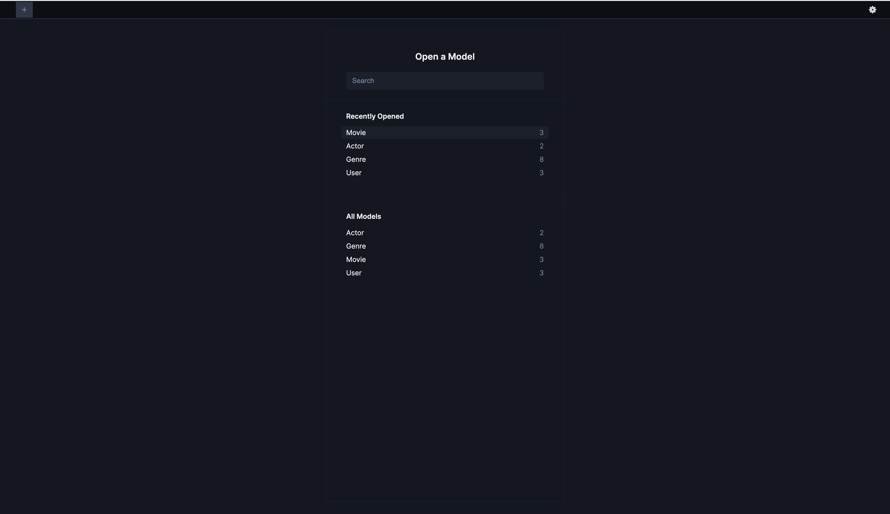

# Movies Listing

This repo uses [docker](https://docs.docker.com/engine/install/) and [docker compose](https://docs.docker.com/compose/install/) for local development. If you don't have them already installed then follow the links to get in installed

## Installation

Clone the repo and install dependencies

```shell
$ git clone git@github.com:shubhamtanwar23/movie-listing.git
$ cd movie-listing
$ docker compose build
```

## Development

Currently there are no API/views to add movie genre and actors. Kindly go through
the [database](#database) section to connect to DB via prisma studio and add entries manually

```shell
# movie-listing
$ docker compose build # (optional) to install all the necessary dependencies
$ docker compose up server # to run the connector
```

Once the server is up and running go to `http//localhost:9000/index.html`

## Database

Prisma provided inbuilt GUI to interact with the database. Run the following command to start the client

```shell
$ npx prisma studio
```

Open the url mentioned in the shell and you should be able to access the various tables

<p align="center">
  
</p>
